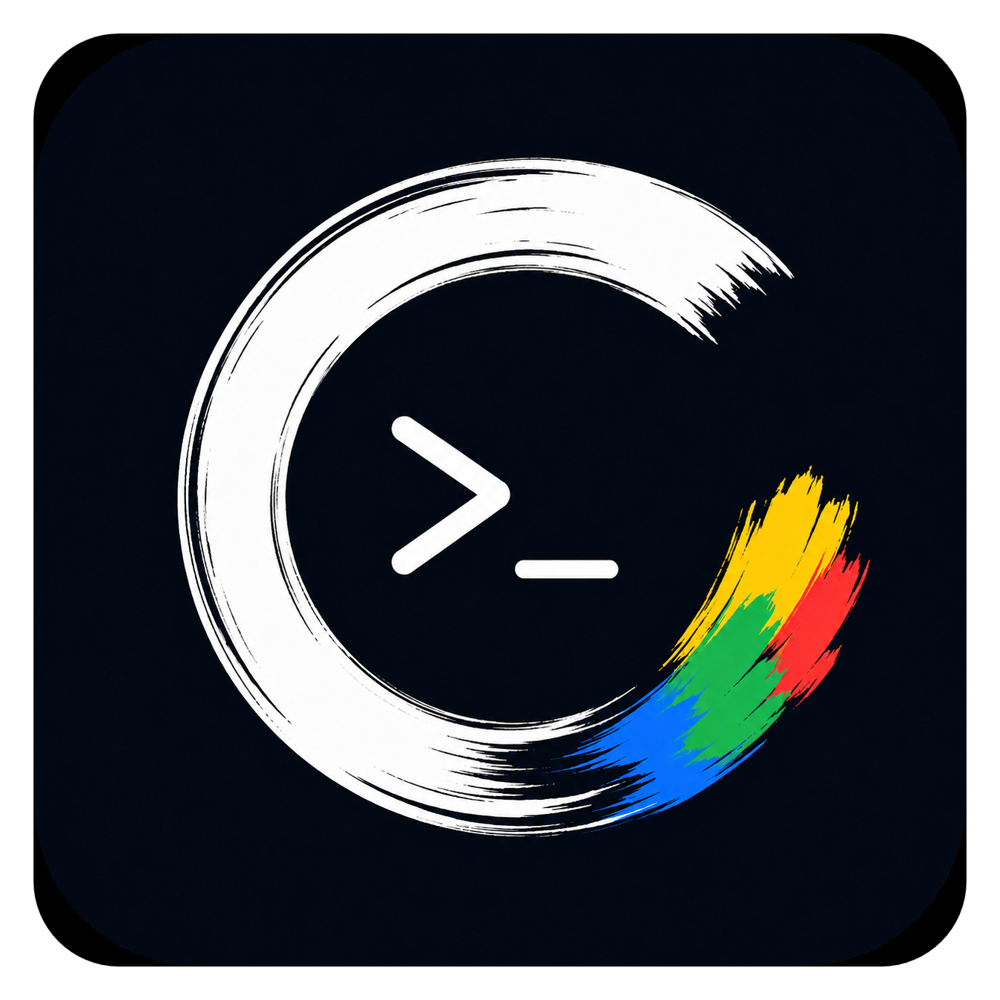
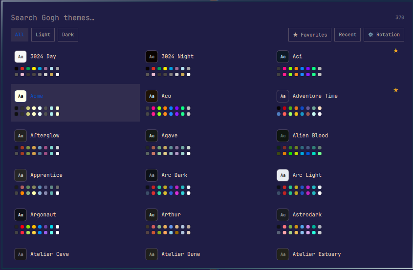
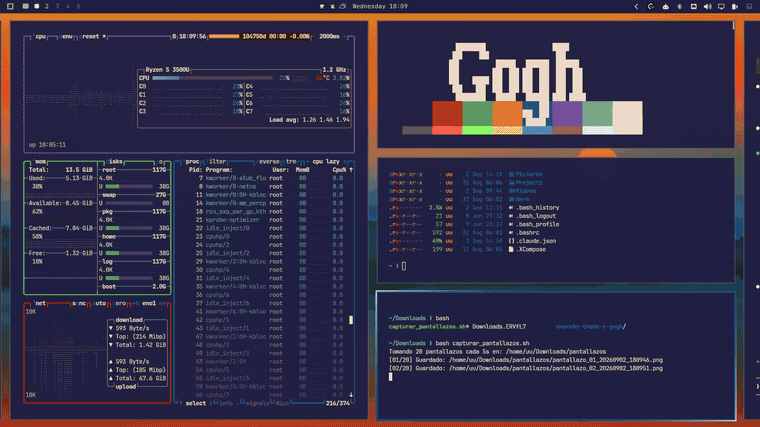

<div align="center">
  
</div>

# Omarchy Theme × Gogh

Turns any of [Gogh](https://github.com/Gogh-Co/Gogh)'s terminal color schemes into a full [Omarchy](https://omarchy.org) system theme. Pick one from the bar and it recolors your whole desktop to match — accents, window and bar backgrounds, foregrounds and the terminal palette — not just the terminal itself. See the [Omarchy Plugin Marketplace](https://github.com/omacom/omarchy-plugin-marketplace) for more Omarchy plugins.

## Install

```bash
omarchy plugin add https://github.com/Gogh-Co/omarchy-theme-x-gogh.git --enable
```

<div align="center">
  
</div>

<div align="center">
  
</div>

### Manual install

```bash
cp -r mgldvd.gogh-themes ~/.config/omarchy/plugins/
omarchy plugin enable mgldvd.gogh-themes
omarchy bar move mgldvd.gogh-themes --section right
omarchy restart shell
```

> The plugin folder's name must exactly match the manifest `id`
> (`mgldvd.gogh-themes`) — Quickshell fails silently otherwise.

## Uninstall

```bash
omarchy plugin disable mgldvd.gogh-themes
omarchy plugin remove mgldvd.gogh-themes
```

### Also remove generated themes and settings

```bash
rm -rf ~/.config/omarchy/themes/gogh-*   # themes you installed
rm -rf ~/.config/gogh-themes             # favorites / history / rotation config
```

## Requirements

`curl`, `jq`, `python3` — all already ship with Omarchy. Config
import/export additionally needs `python-yaml` (`pacman -S python-yaml`);
everything else works without it.

## Features

- **One click install** — search by name/author, filter All / Light / Dark, install & apply instantly.
- **★ Favorites** — star a card or press `Ctrl+D`; filter the grid to just your favorites.
- **Recent** — last 8 applied themes, most recent first.
- **Instant random** — middle-click the bar icon to apply a random theme (favorites-first) with no picker.
- **Auto-rotation** — background timer that swaps your theme on an interval, with snooze, silent mode, and sequential/random order.
- **Config import/export** — back up or move favorites/rotation/history as a YAML file (see [below](#backup--restore-your-config)).
- **Wallpaper-safe** — never replaces or blanks your wallpaper (see [why](#why-your-wallpaper-is-never-touched)).

## Usage

Click the bar icon to open the picker, type to search, `Enter` or click a card to install & apply.

| Key                     | Action                         |
| ----------------------- | ------------------------------ |
| `↑ ↓ ← →`               | Move selection                 |
| `PageUp` / `PageDown`   | Jump a page                    |
| `Tab`                   | Cycle All / Light / Dark       |
| `Ctrl+D`                | Toggle favorite                |
| `Enter`                 | Install & apply                |
| `Esc`                   | Clear search / close           |
| Middle-click (bar icon) | Apply a random theme instantly |

Applied themes land in `~/.config/omarchy/themes/gogh-<slug>/colors.toml` —
revert anytime with `omarchy theme set <previous-theme>`.

## Apps-menu launcher (optional)

Adds "Omarchy Theme × Gogh" to the **Apps** section of the Omarchy menu, independent
of the bar icon:

```bash
cp mgldvd.gogh-themes/mgldvd.gogh-themes.desktop ~/.local/share/applications/
mkdir -p ~/.local/share/icons/hicolor/512x512/apps
cp mgldvd.gogh-themes/icons/mgldvd.gogh-themes.png ~/.local/share/icons/hicolor/512x512/apps/mgldvd.gogh-themes.png
gtk-update-icon-cache ~/.local/share/icons/hicolor 2>/dev/null || true
```

To remove it later:

```bash
rm -f ~/.local/share/applications/mgldvd.gogh-themes.desktop
rm -f ~/.local/share/icons/hicolor/512x512/apps/mgldvd.gogh-themes.png
```

## Backup / restore your config

Open the picker → **⚙** panel → **Config** row → **Export** or **Import**.
Export writes your favorites, rotation settings, silent mode and recent
history as readable YAML to `~/.config/gogh/config-gogh.yml` — no prompt, one click.
Import asks for a file path (defaults to that same `~/.config/gogh/config-gogh.yml`) and
replaces the current config with whatever the YAML file contains — the
picker picks up the change live, no restart needed. Handy for moving your
setup to another machine or just keeping a backup before experimenting.
Invalid YAML (or a non-mapping root) is rejected without touching your
existing config.

```bash
# equivalent from a terminal
~/.config/omarchy/plugins/mgldvd.gogh-themes/bin/gogh-config-export   # -> ~/.config/gogh/config-gogh.yml
~/.config/omarchy/plugins/mgldvd.gogh-themes/bin/gogh-config-import ~/.config/gogh/config-gogh.yml
```

## Why your wallpaper is never touched

Gogh themes are color-only, with no background image. Without one,
`omarchy-theme-set` would leave your wallpaper alone but also fire its own
"No background was found" notification. To keep the silence without losing
that safe behavior, `gogh-theme-install` symlinks whatever wallpaper is
currently active into the new theme's `backgrounds/` folder instead of
copying or generating anything — so `omarchy-theme-set` "finds" a
background, but it's literally the same file that was already there.

## Project structure

```
mgldvd.gogh-themes/
├── manifest.json               # Plugin declaration: id, kinds, entry points, license
├── LICENSE, LICENSE-MIT, LICENSE-APACHE
├── preview.png                  # Marketplace preview screenshot
├── mgldvd.gogh-themes.desktop   # Optional Apps-menu launcher
├── icons/mgldvd.gogh-themes.png # Plugin logo (used by the .desktop entry)
├── BarWidget.qml                # Bar icon, opens the overlay
├── Overlay.qml                  # Fullscreen picker: grid, search, filters, rotation panel
├── GoghThemeSearch.js           # Search + variant filter helpers
└── bin/
    ├── gogh-list-json.sh    # Downloads/caches Gogh's themes.json (24h), slims it down
    ├── gogh-theme-install   # Generates colors.toml for a theme and applies it
    ├── gogh-to-toml.py      # Gogh's 16 ANSI colors + bg/fg → Omarchy colors.toml
    ├── gogh-theme-pick      # Terminal/menu fallback for gogh-theme-install
    ├── gogh-favorite-set    # Marks/unmarks a favorite
    ├── gogh-favorite-clear  # Clears all favorites
    ├── gogh-history-push    # Pushes a theme onto the recent list
    ├── gogh-rotation-set    # Persists one auto-rotation setting
    ├── gogh-silent-set      # Toggles silent mode
    ├── gogh-theme-random    # Applies a random theme (used by middle-click)
    ├── gogh-config-export   # Dumps config.json as YAML to ~/.config/gogh/config-gogh.yml
    ├── gogh-config-import   # Replaces config.json from a given YAML path
    ├── gogh-config-to-yaml.py   # JSON → YAML (stdin → stdout)
    └── gogh-config-from-yaml.py # YAML → JSON, validated (stdin → stdout)
```

## Development notes

- The plugin's directory name must match `manifest.json:id`. A mismatch
  fails `overlay`/`panel`/`menu` entry points with a Qt "File name case
  mismatch" warning followed by an unrelated `ReferenceError` — not
  documented on `plugins.omarchy.org/develop.html`.
- `StdioCollector.text` is a property; `FileView.text` is a function. Using
  the wrong one fails silently, no error logged.
- `omarchy-shell shell rescanPlugins` hot-reload isn't reliable for
  `bar-widget` (cached by file URL) or `overlay` with `keepLoaded: true`
  (the mounted `Item` doesn't always rebuild). Use a full
  `omarchy restart shell` after edits.
- Nerd Font glyphs outside the bar font's range render as tofu — the bar
  icon uses 4 QML `Rectangle`s instead of a text glyph.
- Every script that edits `config.json` writes to a temp file first, then
  `mv`s it into place — but all of them originally used the *same* fixed
  temp filename (`config.json.tmp`). Two writers racing (routine: a single
  rotation tick fires `gogh-rotation-set` *and* `gogh-history-push` as two
  independent detached processes) could truncate each other's temp file
  mid-write, corrupting `config.json` with a dangling fragment of whatever
  was there before. Fixed by giving each writer its own `mktemp`-generated
  temp file; confirmed clean under 60 concurrent writers in testing.

## Credits

Built by [Mgldvd](https://github.com/Mgldvd) — creator of
[Gogh-Co/Gogh](https://github.com/Gogh-Co/Gogh), the color scheme
collection this plugin is built on. Theme data is fetched on demand and
cached locally — no theme data ships in this repo.

[](https://paypal.me/mgldvd?country.x=CO&locale.x=es_XC)

## License


Dual-licensed under [MIT](LICENSE-MIT) or [Apache-2.0](LICENSE-APACHE), at your choice.
